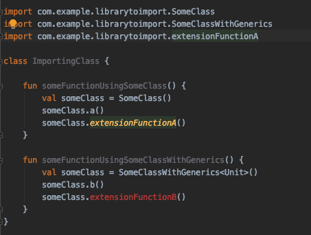
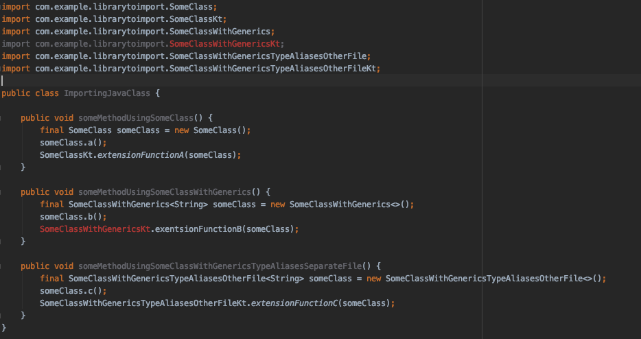
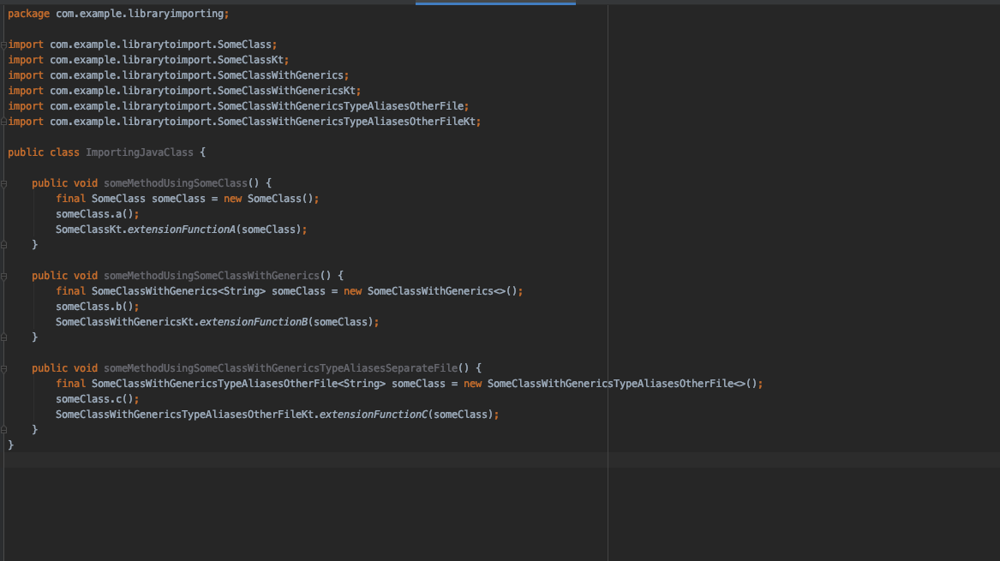

# r8KotlinTypeAliasesObfuscationIssue
R8 has currently issues with obfuscation of files containing type aliases - This is sample repo to reproduce the issue

R8 has issues obfusctating extension files when there are  type aliases with generics defined in the same file.
When either **R8 is disabled** or the **type aliases are moved to a separate file**, everything works wine.

This repository shows the issue in a reproducable way.

## LibraryImporting
This projects imports the `LibraryToImport` as flat aar file.
It contais a kotlin and a java class importing its classes and calling the normal as well as extension functions.

In the `libs` folder you find prebuild `LibraryToImport` release aar files build with several different `gradle-plugin`, `r8` or `proguard` settings.

In its `build.gradle` you can switch between the artifacts by commenting in the corresponding line.
```gradle
	// LibraryToImport build with gradlePlugin Version 4.1.1
    // implementation files('libs/LibraryToImport-release_gradlePlugin4.1.1.aar')

    // LibraryToImport build with gradlePlugin Version 4.1.1 and r8 version 2.1.66
    // implementation files('libs/LibraryToImport-release_gradlePlugin4.1.1_r8_2.1.66.aar')

    // LibraryToImport build with gradlePlugin Version 4.1.1 and r8 version 2.2.41
    // implementation files('libs/LibraryToImport-release_gradlePlugin4.1.1_r8_2.2.41.aar')

    // LibraryToImport build with gradlePlugin Version 4.1.1 and r8 version 3.0.7-dev
    // implementation files('libs/LibraryToImport-release_gradlePlugin4.1.1_r8_3.0.7-dev.aar')

    // LibraryToImport build with gradlePlugin Version 4.1.1 and proguard 6.2.2 - r8 disabled
    implementation files('libs/LibraryToImport-release_gradlePlugin4.1.1_proguard_6.2.2.aar')

    // LibraryToImport build with gradlePlugin Version 4.2.0-alpha16
    // implementation files('libs/LibraryToImport-release_gradlePlugin4.2.0_alpha16.aar')
```

For all files except the `gradlePlugin4.1.1_proguard_6.2.2.aar` the `ImportingJavaClass` won't compile, because the `SomeClassWithGenericsKt` can't be imported. 


## LibraryToImport

This project contains the classes which are imprted it contains three classes `SomeClass`,  `SomeClassWithGenerics` which's type aliases and extensions are in the same file like the class and a `SomeClassWithGenericsTypeAliasesOtherFile` which's type aliases are put into a separate file.

## Images




